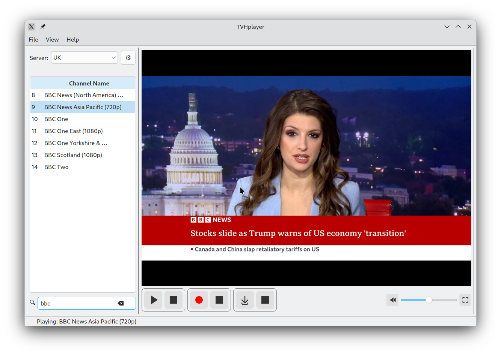

<a href='https://flathub.org/apps/io.github.mfat.tvhplayer'>
    
  </a>

# TVHplayer
A TVheadend client for watching and recording live TV on PC




## Features:

With TVHplayer you can:
- Play live TV & radio channels
  - **Internal player**: Embedded VLC player with full controls (default)
  - **External player**: Open streams in separate VLC window (Settings → Playback Mode)
  - Automatic VLC detection on Windows, macOS, and Linux
- Browse EPG with live progress bars showing current and upcoming programs
  - Robust EPG handling with automatic recovery for missing UI elements
  - Asynchronous updates keep UI responsive even with many channels
  - Word-wrapped tooltips with max-width for better readability
- Schedule recordings
- Initiate instant recordings with custom duration
- Record live TV locally on your computer
- Monitor your server status, signal strength and DVR
- Customize channel icon sizes (48px - 100px)
- Dark Mode support with automatic system theme detection
  - Three modes: Auto (follow system), Light Mode, Dark Mode
  - Theme-aware UI components with optimized color schemes
  - Windows-compatible QSS stylesheets for native widgets
- Persistent UI state - your column widths, sort order, volume level, playback mode, and window layout are remembered
  - Debounced saving prevents excessive disk writes during resizing operations
  - Server selection persists between sessions
  - Volume level and playback mode automatically restored on startup
- Natural/human sorting for channel names (e.g., "Channel 1, 2, 10" not "1, 10, 2")
  - Channels without numbers sort before numbered variants (e.g., "Channel HD" before "Channel 1 HD")
- Per-server icon caching for fast switching between multiple TVHeadend servers
- Column visibility control - show/hide columns via right-click on table header
- TVHplayer is cross-platform - runs on linux, macOS and Windows

## Download

Choose the installer for your operating system from the [releases](https://github.com/mfat/tvhplayer/releases) page:

**Windows:**
- Download `tvhplayer-windows-{version}-setup.exe`
- Run the installer - it will create Start Menu and Desktop shortcuts
- Installs to `%LOCALAPPDATA%\Programs\TVHplayer\`

**macOS:**
- Intel Macs: Download `tvhplayer-macos-intel-{version}.dmg`
- Apple Silicon (M1/M2/M3): Download `tvhplayer-macos-silicon-{version}.dmg`
- Open the DMG and drag TVHplayer to Applications folder

**Linux:**
- **Debian/Ubuntu**: Download `tvhplayer-linux-{version}.deb` and install with:
  ```bash
  sudo dpkg -i tvhplayer-linux-{version}.deb
  sudo apt-get install -f  # Install any missing dependencies
  ```
- **Flathub** (all distros): Install from [Flathub](https://flathub.org/apps/io.github.mfat.tvhplayer)
  ```bash
  flatpak install flathub io.github.mfat.tvhplayer
  ```

<a href='https://flathub.org/apps/io.github.mfat.tvhplayer'>
    
  </a>


## Requirements

**Server Configuration:**
- Make sure both digest and plain authentication are enabled in your TVHeadend server

**System Dependencies:**
- **VLC media player** - Required for video playback (uses system-installed VLC, not bundled)
  - Windows: Download from [videolan.org](https://www.videolan.org/vlc/)
  - macOS: Download from [videolan.org](https://www.videolan.org/vlc/) or install via Homebrew: `brew install --cask vlc`
  - Linux: Install via package manager: `sudo apt install vlc`
- **FFMPEG** (optional) - Only needed for local recording feature
  - Windows: Follow [this guide](https://phoenixnap.com/kb/ffmpeg-windows) to add ffmpeg to PATH, or place `ffmpeg.exe` in the same directory as tvhplayer
  - macOS: Install via Homebrew: `brew install ffmpeg`
  - Linux: Install via package manager: `sudo apt install ffmpeg`
 
## Help and Support
- Refer to the [User Guide](https://github.com/mfat/tvhplayer/wiki/User-Guide) for more information about using the app. 
- If you encounter any problems [open a bug report](https://github.com/user/repository/issues/new)

## Run the app from source 
- You can run the code directly with python. You may want to do this if you don't want to download an executable.
To do this:
- install python
- download the [requirements.txt](https://github.com/mfat/tvhplayer/blob/main/requirements.txt) and run this command:
  `pip install -r requirements.txt`
- Download the tvhplayer zip file from the latest release and extract to a folder or clone using git:
  `git clone https://github.com/mfat/tvhplayer.git`
- cd into the folder
- Run the app with:
  `python3 tvhplayer/tvhplayer.py`

## Technical information

**Architecture:**
- Single-file Python application (~4500+ lines) in `tvhplayer/tvhplayer.py`
- Built with PyQt6 for modern cross-platform GUI
- Uses python-vlc bindings for video playback with hardware acceleration
- TVHeadend HTTP REST API integration (no HTSP support)
- Dynamic theme system with QPalette + QSS stylesheets for cross-platform dark mode
- **Centralized version management**: Single source of truth in `tvhplayer/__version__.py`
  - Used by application code, setup.py, and all build scripts
  - Eliminates version duplication and sync issues

**Build System:**
- Automated builds via GitHub Actions for all platforms
- PyInstaller used for bundling with platform-specific `.spec` files
- **Dynamic version management**:
  - Application version defined in `tvhplayer/__version__.py` (single source of truth)
  - Build artifacts use `VERSION` environment variable from Git tags/workflow
  - `.spec` files read VERSION env var for Info.plist/metadata (fallback: `1.0.0`)
  - Automatic `v` prefix removal (e.g., `v4.0.1` → `4.0.1`)
- Windows: Inno Setup installer with modern UI, filtered Qt6 DLLs, --onedir mode
  - Uses system-installed VLC (not bundled) to save ~133 MB
  - Filtered Qt6 DLLs exclude unused modules (QML, QtQuick, OpenGL SW renderer) - saves ~40-60 MB
  - Automatic config migration from v3.5 (`~/.tvhplayer.conf` → `%APPDATA%/TVHplayer/tvhplayer.conf`)
  - Default recordings saved to Videos folder (`%USERPROFILE%/Videos`)
- macOS: DMG installers for Intel (macos-14) and Apple Silicon (macos-15)
  - Uses system-installed VLC (not bundled) to save ~133 MB
  - PyQt6 optimizations: QML/QtQuick excluded, unused modules filtered - saves ~40-60 MB
  - App bundle with Info.plist containing dynamic version info
- Linux: Debian package (.deb) with dynamic version handling
- Parallel builds with `fail-fast: false` to ensure all platforms complete
- Optimized with caching: pip dependencies, Homebrew, Chocolatey packages

**Performance & Optimization:**
- Optimized HTTP requests with connection pooling and custom User-Agent
- Asynchronous EPG updates with 20ms delays between channels (responsive UI)
- Debounced UI state saving (500ms delay) to prevent excessive disk writes
- Per-server icon caching in `~/.config/tvhplayer/channel_icons/` (Linux/macOS) or `%APPDATA%/tvhplayer/channel_icons/` (Windows)

**Smart Features:**
- Custom natural sorting algorithm for channel names:
  - Extracts base name and number from channel names
  - Sorts alphabetically by base name, then numerically
  - Channels without numbers (e.g., "HD") sort before numbered variants (e.g., "1 HD")
- Robust error handling with automatic recovery:
  - Empty table rows are automatically cleaned up after sorting
  - Missing UI elements are created on-demand during EPG updates
  - Graceful handling of incomplete data structures
  - Proper EPG queue cleanup when switching servers (prevents stale data requests)
  
## Support development
Bitcoin: `bc1qqtsyf0ft85zshsnw25jgsxnqy45rfa867zqk4t`

Doge:  `DRzNb8DycFD65H6oHNLuzyTzY1S5avPHHx`
